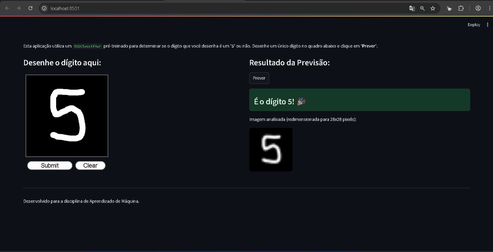

#Validador de Dígito 5 com Streamlit e Scikit-learn

Este projeto é uma atividade da disciplina de Aprendizado de Máquina, que consiste em desenvolver uma aplicação web com Streamlit para validar um classificador binário.

#Descrição
A aplicação utiliza o componente streamlit-mnist-canvas para permitir que o usuário desenhe um dígito. Um modelo SGDClassifier (Classificador de Gradiente Descendente Estocástico), treinado com o famoso dataset MNIST, é usado para prever se o dígito desenhado é o número 5 ou não.

